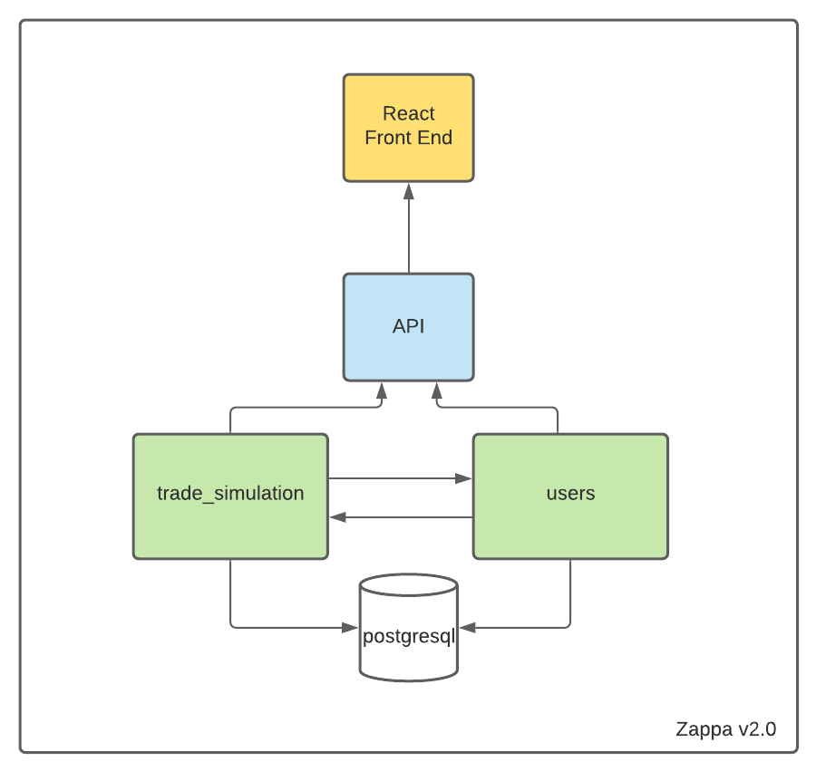
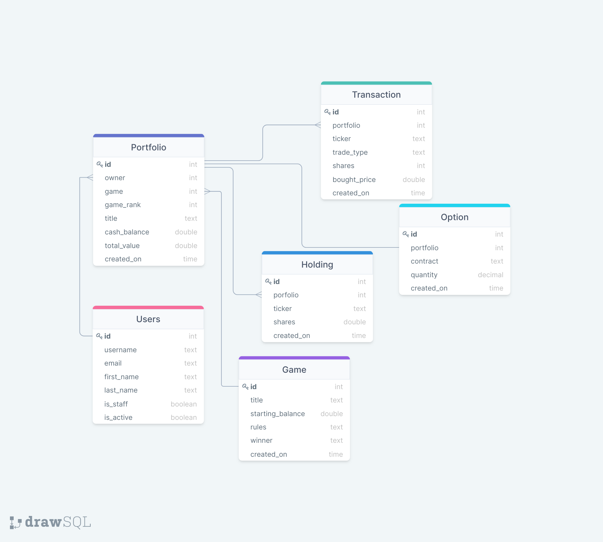

# ZAPPA_4156 Group Project: Trade Simulation

<h2>Overview</h2>

This project is a combination of a front-end program and a back-end API server for creating competitive stock-trading games. Using our service, the owners of virtual stock portfolios with an initial cash balance at the game's start can compete by buying and selling shares of stock at real market prices to achieve the highest portfolio value by the game's end. It uses stock price data from Yahoo Finance, which means players' knowledge of the real stock market will be a competitive advantage.
  

<h2>Online Program</h2>

We host the back-end API server on Heroku, but the client runs on "localhost".

<h3>Back-end API endpoint</h3>
https://zappa-api.herokuapp.com/api

<h3>Client app</h3>
The following installation section explains how to run the client on "localhost".

<h2>Local Installation</h2>

<h3>Installation of required packages</h3>

This repository does not include third-party code other than the auto-generated skeleton code generated by django-admin startproject. Stock data is obtained from Yahoo Finance, using the yfinance python package. We are using AWS to host our postgresql database. This means a few packages need to be installed before use. 

1. To install all required python packages: 
pip install -r .\requirements.txt 

2. To install all required packages for front-end: 
cd .\reactfrontend  
npm install

<h3>How to run the program</h3>

1. run backend server  
python .\manage.py runserver 

2. run client app  
cd .\reactfrontend  
npm start

<h2>Architecture and Technology</h2>

<h3>Architecture v2.0</h3>

 
<h3>Database v2.0</h3>

<h3> Source code </h3>

Our main application logic is contained within the following files:
<ul>
  <li>api/helpers.py</li> 
  <li>api/serializers.py</li>
  <li>api/urls.py</li>
  <li>api/utils.py</li>
  <li>api/views.py</li>
  <li>trade_simulation/models.py</li>
  <li>users/models.py</li>
  <li>users/urls.py</li>
  <li>users/views.py</li>
</ul>

<h3> Continuous integration </h3>

We are using <a href="https://circleci.com/">CircleCI</a> for continuous integration of unit tests, system tests, and style checking.
Additionally, we are using <a href="https://sonarcloud.io/">SonarCloud</a> for static analysis.
All of these tasks occur automatically upon commit in GitHub.

<ul style="list-style-type:none">
<li><h4> Unit tests </h4>
To see the results of our unit tests, check our htmlcov file, or run: coverage run --source='.' manage.py test . 
Currently our branch coverage is at 94%. </li>

<li><h4> System tests </h4>
We have a suite of system tests using Postman, under the <a href="https://columbia-university-student-plan-team-187884.postman.co/workspace/ZAPPA~414bd806-3ab6-4b69-8800-28b2145f10ca/collection/14941238-038eb57b-2eae-4982-9dc1-a5c505356fce">ZAPPA workspace</a>, called "Zappa System Tests." This sequence of requests tests success and possible failure conditions for all use cases of our API, and can also be run manually. </li>

<li><h4>Style compliance</h4>
We are using flake8 for Python style checking; the output file for this is in bugs.txt which is empty. 
To run the tests for flake8 you may run python3 -m flake8 --extend-exclude=./.venv,./zappa/.venv > bugs.txt   </li>

<li><h4>Static analysis</h4>
We are using SonarCloud to check our code for bugs, vulnerabilities, security hotspots, and code smells.  
Additionally, we are using SonarLint to catch a limited subset of these issues instantly in VSCode.</li>
</ul>

<h2>Available endpoints for the backend API service</h2>

Using the resource path http://zappa-api.herokuapp.com, the following methods are available: 

<h4>Games</h4>
Each Game contains Portfolios that compete against each other to attain the highest value. A Game has a "title", "rules", a "starting_balance" that all portfolios within the game are initialized with, and a "winner" to be determined.  

<b>GET</b>   /api/games/ -- Returns the current status of all games and the portfolios within, including the values and rankings of portfolios within each game, using stock bid prices at the time called. 
<b>GET</b>   /api/game/{game_title} -- Returns the current status of the game with title {game_title} and the portfolios within, including the values and rankings of its portfolios, using stock bid prices at the time called. 
<b>POST</b>   /api/game/{game_title} -- Creates a new game with title {game_title}. Requires parameter "rules", and takes optional parameter "startingBalance" (default 10000.0).  
<b>DELETE</b>   /api/game/{game_title} -- Deletes the game with title {game_title}.  

<h4>Portfolios</h4>
Each Portfolio contains Holdings of stocks in various amounts. A Portfolio has a "title", a "cash_balance", a "total_value" computed from stock holdings plus cash balance, and a "game_rank" determined by how its total_value stacks up against other Portfolios in the same Game.  

<b>GET</b>   /api/portfolios/ -- Returns the current status of all portfolios, including the current total_value of each, using stock bid prices at the time called. 
<b>GET</b>   /api/portfolio/{game_title}/{port_title} -- Returns the current status of the portfolio from {game_title} with the title {port_title}, including its current total_value, using stock bid prices at the time called. 
<b>POST</b>   /api/portfolio/{game_title}/{port_title} -- Creates a portfolio in game {game_title} with title {port_title}, with a starting cash_balance equal to the game's starting_balance.  
<b>DELETE</b>   /api/portfolio/{game_title}/{port_title} -- Deletes the portfolio from {game_title} with title {port_title}.  
<b>POST</b>   /api/portfolio/trade -- Performs a transaction on a portfolio. This can be one of two types depending on body parameters:
<ul style="list-style-type:none">
<li>If the value of the required parameter "securityType" is "stock", then parameters "portfolioTitle", "gameTitle", "ticker", and "shares" are required. If the value of "shares" is positive, the portfolio in game "gameTitle" with title "portfolioTitle" will buy "shares" shares of the stock with ticker "ticker". If the value of "shares" is negative, that portfolio will sell "shares" shares of that stock instead. 
Also, if the value of the optional parameter "exercise" is a contract symbol of an option in the portfolio that can be exercised to transact "shares" shares of the stock with ticker "ticker" at a different price, then that option will be exercised, and the quantity of that option in the portfolio will be correctly deducted.
</li>
<li>If the value of the required parameter "securityType" is "option", then parameters "portfolioTitle", "gameTitle", "contract", and "quantity" are required. If the value of "quantity" is positive, the portfolio in game "gameTitle" with title "portfolioTitle" will buy "quantity" amount of options with contract "contract". If the value of "quantity" is negative, that portfolio will sell "quantity" options with that contract instead.</li>
</ul>

<h4>Holdings</h4>
Each Holding represents shares of a stock held in a portfolio. A Holding has a "ticker" and a quantity "shares".  

<b>GET</b>   /api/holdings/ -- Returns all stock holdings in the database. 
<b>GET</b>   /api/holding/{port_title}/{game_title}/{ticker} -- Returns the holding in the portfolio {port_title} within the game {game_title} that has the ticker {ticker}. 

<h4>Options</h4>
Each Option represents the ability to either buy or sell shares of a stock at a specific strike price before its expiration date. An Option has a "contract", which is a string containing the essential info about the option, and a value "quantity". One stock option (quantity 1) can be used to trade 100 shares.  

<b>GET</b>   /api/options/ -- Returns all stock options in the database. 
<b>GET</b>   /api/option/{port_title}/{game_title}/{contract} -- Returns the option in the portfolio {port_title} within the game {game_title} that has the contract symbol {contract}. 

<h4>Transactions</h4>
Each Transaction is a record of a transaction performed by a portfolio. A Transaction may record a portfolio buying or selling stock with or without exercising options, or buying or selling options. A Transaction has a "ticker", a "trade_type" depending on what was performed, a quantity "shares", and a "bought_price" recording the price at the time of transaction.  

<b>GET</b>   /api/transactions/ -- Returns all transaction records in the database. 
<b>GET</b>   /api/transaction/{uid} -- Returns the transaction record with uid {uid}. 

